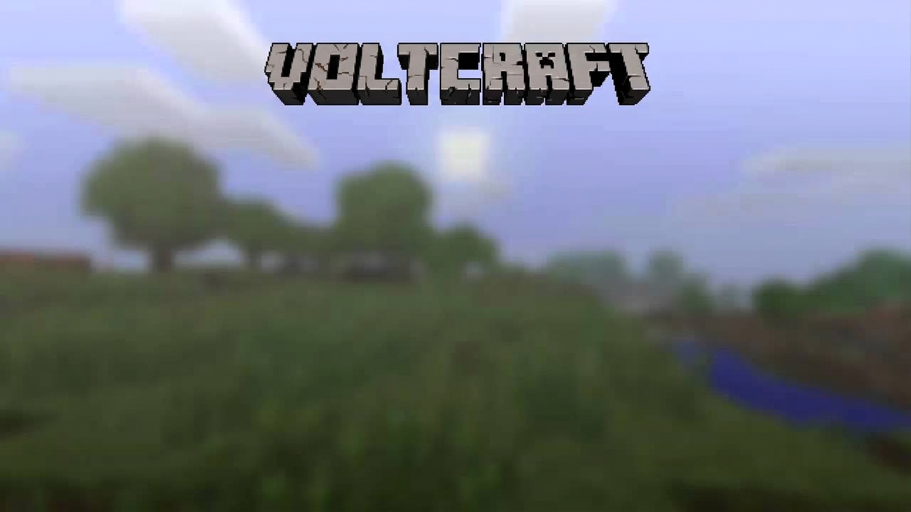

# Voltcraft



Voltcraft is an open-source, web-based voxel game crafted with Three.js and TypeScript, designed by **bxzex**. 

## Features

- **Procedural Voxel Terrain:** Infinitely generated worlds with caves, trees, and resources!
- **Multiplayer Support:** Built-in WebRTC using PeerJS lets you connect instantly via a shared World ID.
- **Weather System:** Clear, rain, and thunderstorms that synchronize across the entire server.
- **Entity System:** Enjoy procedurally generated pigs, cows, and other interactive entities.
- **Minecraft Interface:** Immersive HUD, hotbar, and pause menu built with a retro aesthetic.
- **Chat System:** Synchronized server chat overlay.

## Installation

```bash
# Clone the repository
git clone https://github.com/bxzex/voltcraft.git

# Enter the directory
cd voltcraft

# Install dependencies
npm install

# Start development server
npm run dev

# Build for production
npm run build
```

## Controls

- **Left-Click:** Destroy block
- **Right-Click:** Place block
- **Wheel / Number Key:** Change block in hotbar
- **WASD:** Move
- **Space:** Jump / Fly up
- **Q:** Toggle normal / dev mode
- **Shift:** Sneaking / Fly down
- **F:** Full screen
- **E / ESC:** Open pause menu

## License

MIT License. Copyright (c) 2026 bxzex.
